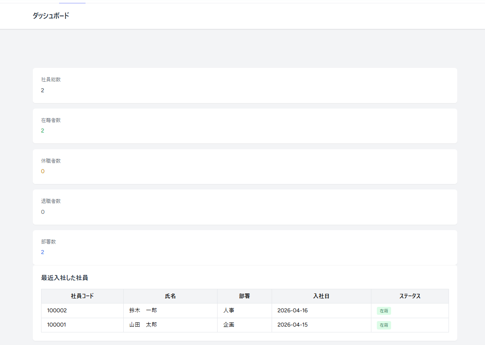
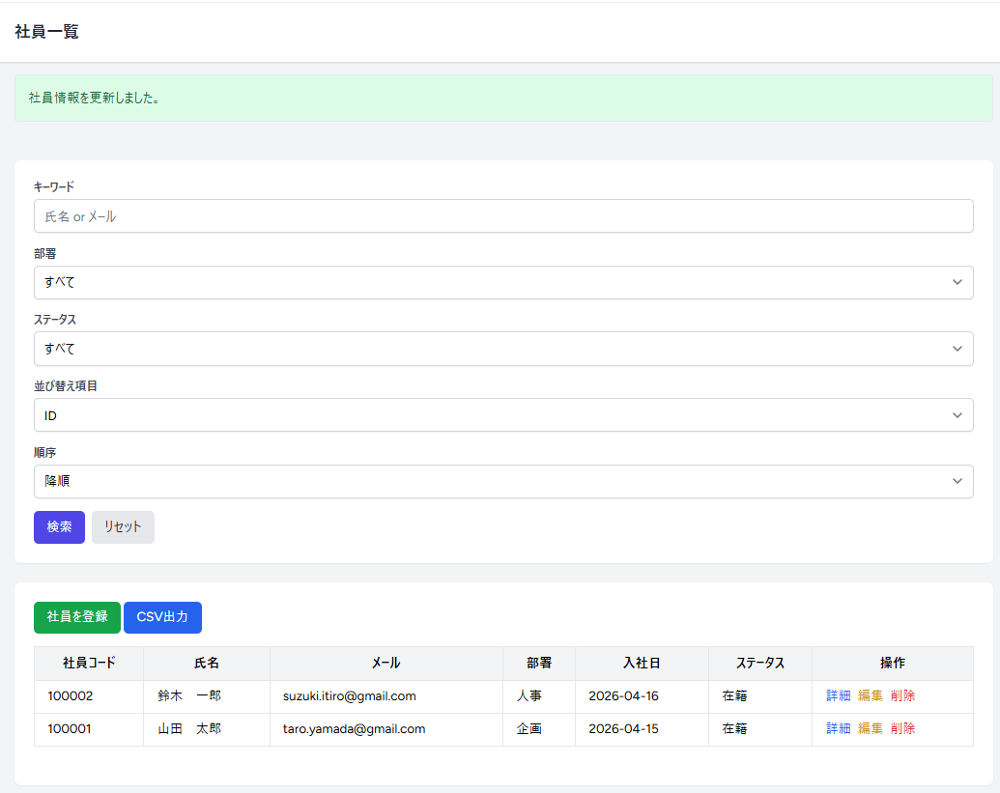
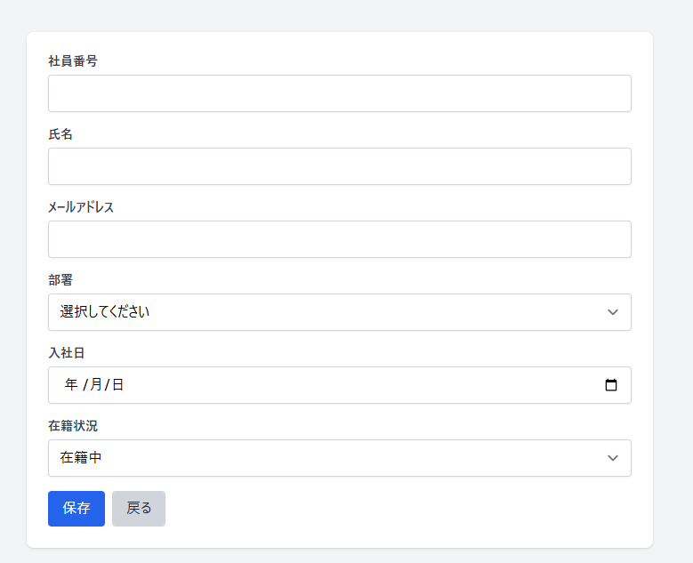
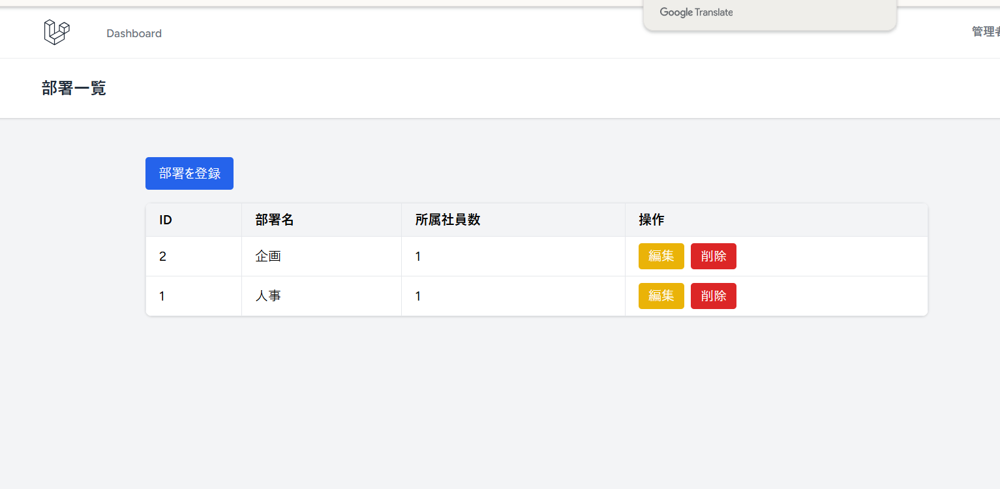

# 🧑‍💼 社員管理システム（Employee Management App）

## 📌 概要
本アプリは、社員情報および部署情報を一元管理するWebアプリケーションです。  
実務でよくある「社員情報の検索・管理・集計」を想定し、業務効率化を目的として開発しました。

認証・権限管理・検索・CSV出力など、実務で求められる機能を意識して設計しています。

---

## 🔗 デモURL
https://example.com

---

## 🔑 テスト用アカウント

### ■ 管理者アカウント
メール：admin@test.com  
パスワード：password  

※ 登録・編集・削除など全機能が利用可能です

### ■ 一般ユーザー
メール：user@test.com  
パスワード：password  

※ 閲覧のみ可能です（権限制御を確認できます）

---

## 📸 スクリーンショット

### ■ ダッシュボード

### ■ 社員一覧（検索・フィルタ・並び替え）

### ■ 社員登録画面

### ■ 部署管理

---

## ⚙️ 主な機能

### ■ 社員管理
- 一覧表示（ページネーション対応）
- 登録 / 編集 / 削除 / 詳細表示
- 検索（氏名・メールの部分一致）
- フィルタ（部署・ステータス）
- 並び替え（カラムクリックで昇順・降順切替）

### ■ 部署管理
- 一覧 / 登録 / 編集 / 削除
- 社員が紐づく部署は削除不可（データ整合性を担保）

### ■ 認証・権限管理
- Laravel Breezeによるログイン機能
- Policyによる権限制御
  - 管理者：admin → CRUD可能
  - 一般ユーザー → 閲覧のみ
- Blade（@can）＋Controller（authorize）で二重制御

### ■ CSV出力
- 検索・フィルタ条件を維持したまま出力
- BOM付きでExcel文字化け対策

### ■ ダッシュボード
- 社員数（総数・在籍・休職・退職）
- 部署数
- 最近入社した社員一覧
- 各画面への導線あり

### ■ UI/UX改善
- フラッシュメッセージのコンポーネント化
- ステータスの色分け表示
- 操作結果が分かりやすい設計

---

## 🛠 技術スタック
- バックエンド：Laravel / PHP
- フロントエンド：Blade / Tailwind CSS
- データベース：MySQL
- 環境構築：Docker（nginx / php / mysql / phpmyadmin）

---

## 💡 工夫した点

### ■ 検索・フィルタ・ソートの統一設計
検索・フィルタ・並び替え処理を  
`buildEmployeeQuery()` に集約し、保守性と再利用性を向上させました。

### ■ 実務を意識したデータ制約
- 社員が紐づく部署は削除不可  
→ 不整合データを防ぐ設計

### ■ 権限管理の二重制御
- Blade（UI）＋Controller（authorize）  
→ セキュリティを意識

### ■ CSV出力の実務対応
- フィルタ状態維持  
- BOM付き対応  
→ Excelでそのまま使える

### ■ UIの使いやすさ
- メッセージ表示統一  
- 色で状態を可視化  

### ■ リファクタリング
- クエリ処理の共通化  
- バリデーション整理  

---

## 🚧 今後の課題
- テストコードの追加（Feature / Unit）
- API化（SPA対応）
- ロール管理の拡張
- UIの改善（モーダルなど）

---

## 📚 補足
本アプリは以下を意識して開発しました：

- 実務に近い機能の再現
- 保守性の高い設計
- セキュリティ（権限制御）の考慮
- 操作しやすいUI設計